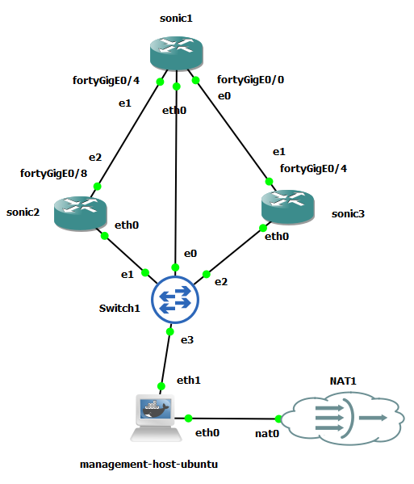
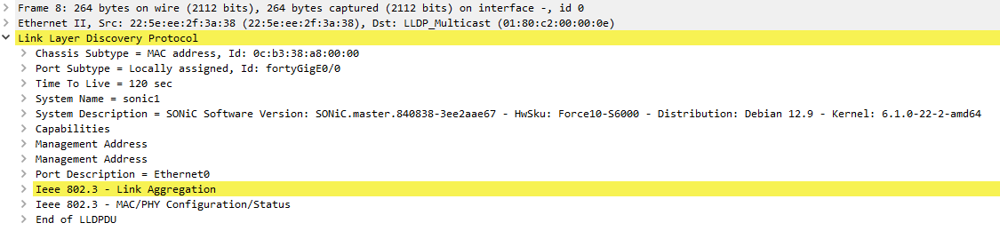
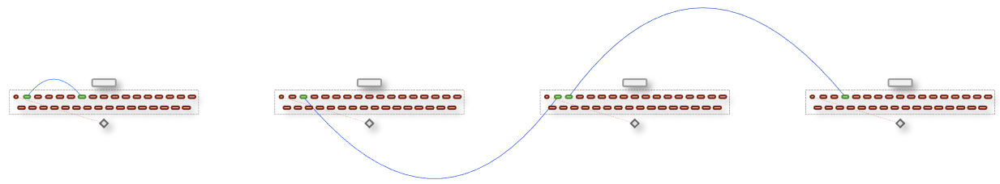
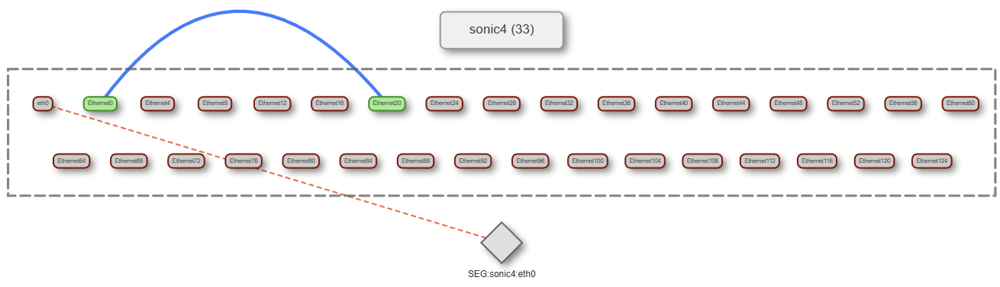

# LLDP Topology Visualizer

LLDP Topology Visualizer is a lightweight tool for discovering and visualizing physical and logical network topology in SONiC-based environments using LLDP data. It connects to multiple SONiC devices, collects LLDP neighbor information, normalizes the results into a topology-aware graph, and renders an interactive HTML visualization that allows operators to inspect devices, ports, and links at varying levels of detail. The visualizer is designed to work cleanly in both real hardware and lab environments (such as GNS3). The resulting topology provides an intuitive, scalable view of port-level relationships, link state, and neighbor mappings, making it suitable for troubleshooting, validation, and lab exploration.

Refer to [LLDP guide](./README_LLDP.md) for more detailed information.

## LLDP Architecture in SONiC

SONiC implements LLDP as a dedicated Docker-based service. LLDP runs inside a container named `lldp`, which hosts `lldpd`, a widely used, standards-compliant open-source LLDP daemon for Linux systems. This container is responsible for all LLDP protocol operations on the device, including the transmission and reception of LLDP frames, TLV processing, and the publication of neighbor information to SONiC's internal state database (STATE_DB).

Note that LLDP only works on `admin-up` interfaces. Even though LLDP is enabled globally, if an interface is `admin-down`, LLDP will not transmit or receive. If there is no physical link, LLDP frames won’t be exchanged. Also note that LLDP operates entirely at Layer 2 (Ethernet). It is carried directly in Ethernet frames and does not use IP, TCP, or UDP. Because of this, you do not need IPv4 or IPv6 addresses. Moreover, you do not need VLAN or forwarding configuration.

## GNS3 Lab Topology

Create the following topology consisting of four sonic nodes inside GNS3:



The management-host is a Docker container that is built on Ubuntu 20.04.2 LTS. In our topology, it is configured to serve as a dedicated DHCP server. Refer to [here](https://github.com/ManiAm/GNS-Bench/blob/master/docs/Management_host.md) to learn how to set it up.

By default, every SONiC image ships with the hostname set to `sonic`. LLDP advertises this value via the "System Name" TLV. So when you run one of CLIs above, each neighbor appears as `sonic`, even though they are different switches. LLDP does not require unique hostnames. Neighbor entries are keyed internally by "Chassis ID + Port ID". However, it is strongly recommended to change the hostname on each SONiC node for LLDP clarity, troubleshooting, and any kind of topology work.

Open a terminal to each node and change the hostname accordingly:

    admin@sonic:~$ sudo config hostname sonic1
    admin@sonic:~$ sudo config save -y

In SONiC, the baseline (upstream) LLDP CLI surface is intentionally small. SONiC focuses on exposing essential, vendor-neutral commands, while leaving room for vendors to extend or enhance the CLI if needed. These two commands are the primary, officially supported ones:

    show lldp table
    show lldp neighbors

LLDP data is stored in `STATE_DB`, and CLIs above read from the DB (not directly from the `lldp` container). Check the LLDP neighbors on `sonic1`:

    admin@sonic1:~$ show lldp table

    Capability codes: (R) Router, (B) Bridge, (O) Other
    LocalPort    RemoteDevice    RemotePortID       Capability    RemotePortDescr
    -----------  --------------  -----------------  ------------  -----------------
    Ethernet0    sonic3          fortyGigE0/4       BR            Ethernet4
    Ethernet4    sonic2          fortyGigE0/8       BR            Ethernet8
    eth0         sonic4          0c:69:cf:50:00:00  BR            eth0
    eth0         sonic2          0c:22:21:ac:00:00  BR            eth0
    eth0         sonic3          0c:86:68:13:00:00  BR            eth0
    --------------------------------------------------
    Total entries displayed:  5

Note that `sonic1` sees three neighbors (`sonic2`, `sonic3` and `sonic4`) on its eth0 interface. This is due to GNS3 ethernet switch limitation that simply floods LLDP frames out of all ports. This would never happen on a real switch.

### Interface Naming and Mapping

When you work with SONiC in GNS3, you will see three different layers of interface naming, each coming from a different part of the stack. They represent the same physical or virtual link, but from different perspectives.

```text
admin@sonic2:~$ show interfaces status

  Interface            Lanes    Speed    MTU    FEC           Alias    Vlan    Oper    Admin    Type    Asym PFC
-----------  ---------------  -------  -----  -----  --------------  ------  ------  -------  ------  ----------
  Ethernet0      25,26,27,28      40G   9100    N/A    fortyGigE0/0  routed    down       up     N/A         N/A
  Ethernet4      29,30,31,32      40G   9100    N/A    fortyGigE0/4  routed    down       up     N/A         N/A
  Ethernet8      33,34,35,36       1G   9100    N/A    fortyGigE0/8  routed      up       up     N/A         N/A
 Ethernet12      37,38,39,40      40G   9100    N/A   fortyGigE0/12  routed    down       up     N/A         N/A
 Ethernet16      45,46,47,48      40G   9100    N/A   fortyGigE0/16  routed    down       up     N/A         N/A
 Ethernet20      41,42,43,44      40G   9100    N/A   fortyGigE0/20  routed    down       up     N/A         N/A
```
- **Ethernet`X`** (SONiC's logical interface name)

    These are SONiC's logical front-panel ports. They are:

    - Defined by the platform / hardware SKU
    - What SONiC uses for configuration, LLDP, VLANs, etc.
    - What you see in different CLIs

    This is the primary interface name you should care about when operating SONiC.

- **Lanes** (hardware / ASIC mapping)

    Each SONiC interface is backed by one or more lanes, for example:

        Ethernet0   lanes: 0,1,2,3

    Lanes represent physical SerDes channels on the ASIC. They describe how the port is wired internally. Lanes are not something you configure directly. They exist to map SONiC’s logical port to ASIC resources. In Sonic VS, lanes are still present for consistency with real hardware, even though no real ASIC exists.

    Lanes are also the reason SONiC logical interface names appear to skip numbers (for example, `Ethernet0`, `Ethernet4`, `Ethernet8`). SONiC assigns interface indices based on lane consumption, not on a simple sequential port count. If a logical interface consumes four lanes, the next logical interface starts at the next available lane index. This model ensures a deterministic and hardware-aligned mapping between logical ports and underlying ASIC resources.

- **Alias** (human-friendly or vendor-friendly name)

    An alias is an alternative name for the same SONiC interface, such as:

        Ethernet0  alias: fortyGigE0/0

    Aliases exist to:

    - Match vendor-style port naming
    - Match front-panel labels
    - Improve readability for operators

- **e`X`** (QEMU virtual NICs)

    In GNS3, when SONiC runs inside QEMU, each virtual network adapter is named something like `e0`, `e1`, `e2`. They represent virtual ethernet devices attached to the VM. You generally do not configure these directly inside SONiC. The GNS3 GUI uses these virtual NICs naming. This is expected behavior and often a source of confusion for new users. You must know which GNS3 `eX` interface corresponds to which `EthernetX` port in SONiC in order to cable the topology correctly.

### LLDP Packet Analysis with Wireshark

In SONiC, LLDP is not a hard-coded feature set. Instead, the LLDP PDU is assembled dynamically at runtime based on multiple factors: Sonic version, Platform (hardware SKU), Linux kernel and system configuration. The LLDP PDU on the wire is the source of truth. Here is the captured LLDP PDU from `sonic1` to `sonic3`.



### SSH Access to GNS3 Devices

To access sonic devices inside GNS3 topology from your local machine, you must traverse two intermediate hosts. To simplify access, you can define a chain of jump hosts using an SSH configuration file (`~/.ssh/config`) on your host. This approach eliminates the need to manually specify ProxyJump or perform step-by-step SSH hops. Add the following entries to your SSH config:

```text
Host gns3-vm-lldp
    HostName 192.168.2.107
    User gns3

# password: gns3
Host mgmt-host-lldp
    HostName 192.168.122.23
    User root
    ProxyJump gns3-vm-lldp

Host sonic1-lldp
    HostName 10.10.10.100
    User admin
    ProxyJump mgmt-host-lldp

Host sonic2-lldp
    HostName 10.10.10.102
    User admin
    ProxyJump mgmt-host-lldp

Host sonic3-lldp
    HostName 10.10.10.101
    User admin
    ProxyJump mgmt-host-lldp

Host sonic4-lldp
    HostName 10.10.10.103
    User admin
    ProxyJump mgmt-host-lldp
```

Make sure to setup passwordless SSH access to both `gns3-vm-lldp` and `mgmt-host-lldp`. Once this configuration is in place, you can access any of the sonic devices using a single command:

    ssh sonic1-lldp

The default password is `YourPaSsWoRd`.

## LLDP Topology Visualizer

Open the [config.py](./config.py) file and ensure that all SONiC devices you want to include in the topology are listed. Then invoke the main script:

    python3 main.py

The program connects to each SONiC device sequentially and retrieves LLDP neighbor information from every node. Using this data, it constructs a logical and physical topology and generates an interactive HTML visualization (`topology.html`). You can open the generated file in any modern web browser. The resulting topology is fully interactive:

- Zoom and pan to explore the network at different levels
- Click on a device to expand and view its connected ports
- Click on a port to highlight its link and remote endpoint
- Click on a link to highlight both endpoint ports and inspect link metadata

Each port is color-coded based on its operational state, allowing you to quickly identify link health and connectivity issues. The visualization is implemented using the `vis-network` JavaScript library, which provides an efficient, scalable graph engine with support for large topologies, dynamic layouts, and interactive inspection.



Below is a zoomed-in view of the topology, highlighting individual port connections and link details:


During execution, you may see messages similar to the following printed in the terminal:

```text
NOTE: Shared-segment / flooded LLDP detected:
  - sonic1:eth0 sees multiple neighbors (sonic2:eth0, sonic3:eth0, sonic4:eth0)
  - sonic2:eth0 sees multiple neighbors (sonic1:eth0, sonic3:eth0, sonic4:eth0)
  - sonic3:eth0 sees multiple neighbors (sonic1:eth0, sonic2:eth0, sonic4:eth0)
  - sonic4:eth0 sees multiple neighbors (sonic1:eth0, sonic2:eth0, sonic3:eth0)
```

This indicates that, based on LLDP data, a single local port is receiving advertisements from multiple remote devices. This typically occurs when devices are connected through a Layer-2 segment that floods LLDP frames. Rather than incorrectly representing these connections as point-to-point links, the visualizer models them using a dedicated SEG (segment) node. This makes shared media explicit in the topology and avoids misleading direct links between devices.

## Physical Loopback

A physical loopback is created by physically connecting two ports on the same device using an external medium typically a copper or fiber cable. From the device’s perspective, traffic transmitted out of one port immediately re-enters the device through another port. This is different from a logical or internal loopback (which is implemented in software or ASIC microcode). A physical loopback exercises the real, external datapath: port PHYs, MACs, serdes, cabling, and ingress/egress pipelines. Physical loopbacks are commonly used for:

- **Dataplane validation**: Verifies that packets can exit one port, traverse a physical link, and re-enter another port.
- **Snake testing**: Enables chained forwarding paths without requiring multiple external devices.
- **SerDes testing**: Confirms correct operation of the physical interface, not just internal forwarding logic.
- **Troubleshooting**: Helps isolate whether issues originate in the ASIC, the port hardware, or the external link.

In GNS3, you generally cannot directly connect two interfaces of the same virtual device. The simulator enforces a topology model where links are always formed between distinct nodes. A common workaround is to introduce a simple intermediary device like a hub to connect two ports of the same device. Logically, this creates a loopback path:

    Switch Port A → Hub → Switch Port B

When a switch has a physical loopback, LLDP reports each port as the neighbor of the other. From LLDP’s point of view, there is no concept of self-awareness; it simply advertises and receives neighbor information on each interface. Here is a sample LLDP output on `sonic4`:

    admin@sonic4:~$ show lldp table

    Capability codes: (R) Router, (B) Bridge, (O) Other
    LocalPort    RemoteDevice    RemotePortID       Capability    RemotePortDescr
    -----------  --------------  -----------------  ------------  -----------------
    Ethernet0    sonic4          fortyGigE0/20      BR            Ethernet20   <---------------
    Ethernet20   sonic4          fortyGigE0/0       BR            Ethernet0    <---------------
    eth0         sonic2          0c:22:21:ac:00:00  BR            eth0
    eth0         sonic3          0c:86:68:13:00:00  BR            eth0
    eth0         sonic1          0c:b3:38:a8:00:00  BR            eth0
    --------------------------------------------------
    Total entries displayed:  5

The visualizer displays a link between two ports on the same switch. This is expected behavior and indicates a self-loop via an external medium, not an internal wiring error. Such visual output is a useful confirmation that the loopback path is correctly formed and visible at Layer 2.


