# Link Layer Discovery Protocol (LLDP)

LLDP is a layer 2 neighbor discovery protocol used by network devices to advertise their identity, capabilities, and interface information to directly connected neighbors. LLDP operates at the data link layer and is defined by `IEEE 802.1AB`, formally named "Station and Media Access Control Connectivity Discovery".

In a heterogeneous network, LLDP ensures that different types of network devices from different vendors can discover one another and exchange configuration. It was developed as an open, vendor-neutral alternative to proprietary discovery protocols, such as:

- Cisco Discovery Protocol (**CDP**)
- Foundry Discovery Protocol (**FDP**)
- Nortel Discovery Protocol (**NDP**)
- Microsoft Link Layer Topology Discovery (**LLTD**)

LLDP is primarily a wired, Ethernet (IEEE 802.3) protocol. It operates by sending small, periodic advertisement frames (default every 30 seconds) out of each Ethernet interface so neighbors can learn who is connected where. LLDP does not make routing or forwarding decisions and does not influence traffic flow in any way. It is strictly a neighbor discovery and information reporting mechanism.

Wi-Fi access points do use LLDP, but only on their wired uplink, not over the wireless (802.11) radio. An AP typically advertises itself via LLDP to the access switch to communicate information such as its identity, capabilities, VLAN expectations, and PoE requirements. Wireless clients (laptops, phones, tablets) do not participate in LLDP, because LLDP is not a native Wi-Fi protocol.

> Typical devices that use LLDP include network switches and routers (to discover topology), IP phones (for voice VLAN and QoS discovery), Wi-Fi access points (on the wired uplink), and hypervisors or servers (to identify switch ports and fabric connectivity).

Information learned via LLDP is stored in a Management Information Base (MIB) on the receiving device. This information can be queried using:

- SNMP
- Local CLI commands
- Network Management Systems (NMS)

## LLDP Usage

### Network Topology Discovery

LLDP is widely used to automatically discover the physical topology of a network, especially in environments with devices from multiple vendors. By periodically advertising identity and port information on each wired interface, LLDP allows devices and management systems to learn which device is connected to which port, without any manual documentation. This makes it possible to build accurate, real-time topology maps that reflect the actual cabling and physical layout of the network.

Because LLDP operates at Layer 2 and only between directly connected neighbors, the topology information it provides is precise and unambiguous. Network management systems can collect LLDP data from devices and stitch these neighbor relationships together to reconstruct the full network graph.

### Network Troubleshooting

LLDP is a powerful troubleshooting tool because it provides immediate visibility into what is physically connected to a given port. When diagnosing connectivity issues, engineers can quickly verify whether the correct device and interface are attached, identify mis-cabled links, or detect unexpected neighbors. This is especially valuable in large data centers or wiring closets where manual tracing is difficult and error-prone.

LLDP can also help surface configuration mismatches, such as VLAN, MTU, or speed/duplex inconsistencies, by exposing each device’s advertised capabilities and expectations. While LLDP itself does not resolve these problems, it gives operators the ground truth needed to pinpoint the issue at the physical or link layer before investigating higher-layer protocols.

### Network Automation

In automated environments, LLDP serves as a foundational source of truth for physical connectivity, enabling higher-level systems to make informed decisions. During Zero-Touch Provisioning (ZTP) and initial fabric bring-up, controllers use LLDP data to determine device roles (leaf, spine, edge), validate cabling, and confirm that links are connected as expected before pushing configuration. This reduces human error and accelerates deployment.

At scale, data center orchestration and fabric management systems continuously consume LLDP information to maintain an up-to-date view of the network. If links change, devices are replaced, or cables are moved, LLDP allows the system to detect these changes automatically and trigger appropriate workflows. LLDP itself does not configure or control devices. It simply provides reliable neighbor intelligence that automation platforms build upon.

## LLDP Security

LLDP is not a secure protocol by design. It does not provide authentication, encryption, or integrity protection. LLDP frames are sent in clear text at Layer 2, which means any device connected to the same physical link can read the information being advertised. There is no mechanism to verify the identity of the sender or to prevent a malicious or misconfigured device from advertising false information.

Because of these limitations, LLDP should be treated as an informational protocol, not a trusted control mechanism. The data it provides (such as device identity, port names, system descriptions, and management addresses) can be extremely useful for operations, but it can also unintentionally expose details about network infrastructure if used indiscriminately.

For this reason, LLDP is commonly disabled on untrusted or user-facing ports, such as access ports connected to end hosts, where there is no operational need for neighbor discovery. Instead, it is typically enabled only on trusted infrastructure links, such as switch-to-switch, switch-to-router, or switch-to-access-point connections. This approach balances operational visibility with security, ensuring LLDP is available where it adds value while minimizing unnecessary information exposure.

## Ethernet LLDP Frame Format

LLDP information is sent inside a single Ethernet frame containing one LLDP Data Unit (LLDPDU).

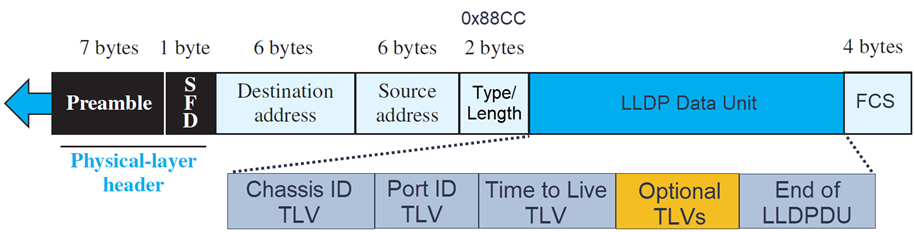

EtherType is set to `0x88CC` and the destination MAC is set to `01:80:C2:00:00:0E`. This MAC address is part of the IEEE 802.1 link-local multicast address block. Such MAC address is valid only on the local Ethernet segment (link-local), and bridges must not forward them. This means that even if a switch doesn't understand LLDP, it must not forward the frame. In other words, LLDP frames are never flooded across the network.

LLDPDUs are composed of TLVs (Type-Length-Value):

| Field  | Size         |
| ------ | ------------ |
| Type   | 7 bits       |
| Length | 9 bits       |
| Value  | 0-511 octets |

You can find different TLV types in here:

|  TLV Type | TLV Name                       | Notes                                             |
| --------: | ------------------------------ | ------------------------------------------------- |
|     **0** | End of LLDPDU                  | Marks the end of the TLV sequence                 |
|     **1** | Chassis ID                     | Identifies the device (commonly MAC address)      |
|     **2** | Port ID                        | Identifies the transmitting port                  |
|     **3** | Time To Live (TTL)             | Validity period (seconds)                         |
|     **4** | Port Description               | Human-readable port description                   |
|     **5** | System Name                    | Hostname (often FQDN)                             |
|     **6** | System Description             | OS, hardware, and software info                   |
|     **7** | System Capabilities            | Indicates device roles (switch, router, AP, etc.) |
|     **8** | Management Address             | Management IP and related info                    |
| **9-126** | Reserved                       | Reserved by IEEE; not currently used              |
|   **127** | Organizationally Specific TLVs | Vendor and standards extensions (OUI-based)       |

Each LLDP frame starts with the following mandatory TLVs: Chassis ID, Port ID, and Time to Live. The mandatory TLVs are followed by any number of optional TLVs. The frame ends with a special TLV, named "End of LLDPDU".

## TLV Types

### TLV Type 0 - End of LLDPDU

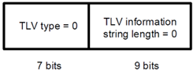

The "End of LLDPDU" TLV marks the logical end of the LLDP Data Unit. It is required so the receiving device can distinguish real LLDP information from Ethernet padding bytes. Ethernet frames must meet a minimum size, and if the LLDP payload is smaller, padding is added. Without this TLV, a receiver could mistakenly interpret padding bytes as valid TLVs. This TLV has a fixed value of zero and contains no data. Its presence ensures correct parsing and protects against malformed or ambiguous frames.

### TLV Type 1 - Chassis ID

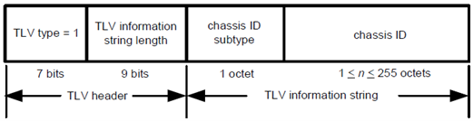

The "Chassis ID" TLV identifies the device itself, not the interface. It answers the question: "Which device is sending this LLDP packet?". The identifier can be represented in several ways (base MAC address, network address, or locally assigned value), but the most common and recommended format is the device’s base MAC address. The base MAC is sometimes called system MAC, chassis MAC, or burned-in MAC.

The Chassis ID is fundamental to LLDP because it allows neighbors to uniquely identify devices, even if hostnames change. Together with the Port ID, it forms the MSAP (MAC Service Access Point) identifier, which uniquely identifies a neighbor interface.

### TLV Type 2 - Port ID

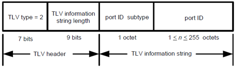

The "Port ID" TLV identifies the specific interface on the transmitting device that sent the LLDP packet. It answers the question: "Which port on that device is connected to me?". Common representations include interface names (such as Ethernet0), MAC addresses, or locally assigned identifiers. In practice, most systems use the `ifName` value defined in IF-MIB. When combined with the Chassis ID, the Port ID allows precise port-to-port topology mapping.

### TLV Type 3 - Time To Live (TTL)

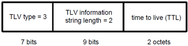

The "Time To Live" (TTL) TLV specifies how long the advertised information remains valid on the receiving device. The value is expressed in seconds and defines when the neighbor entry should be aged out if no new LLDP packets are received.

A TTL of zero is a special case that signals the receiving device to immediately delete all information associated with that neighbor, commonly used during interface shutdown. TTL ensures that LLDP information stays fresh and self-correcting.

### TLV Type 4 - Port Description

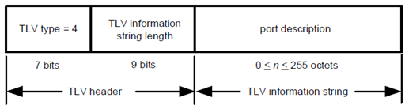

The "Port Description" TLV provides a human-readable description of the transmitting interface. This typically matches the interface description configured by an administrator (for example, "Uplink to Core Switch"). This TLV is especially useful for operations and troubleshooting, allowing engineers to quickly understand port intent without logging into the remote device.

### TLV Type 5 - System Name

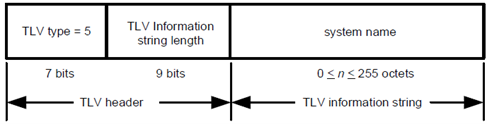

The "System Name" TLV advertises the administratively assigned name of the device, often the fully qualified domain name (FQDN). It allows neighbors and management systems to associate a friendly, recognizable name with the device. This TLV improves readability in monitoring tools and topology maps but does not affect LLDP operation or neighbor identification.

### TLV Type 6 - System Description

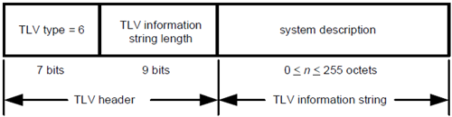

The "System Description" TLV provides a textual description of the device, typically including the hardware platform, operating system, and software version. It often mirrors the `sysDescr` object from SNMP. This information is valuable for inventory tracking, audits, and troubleshooting, especially in multi-vendor environments.

### TLV Type 7 - System Capabilities

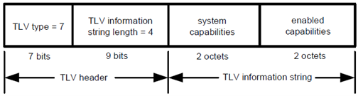

The "System Capabilities" TLV indicates what kind of device the sender is and which capabilities are currently enabled using bitmaps.

|   Bit | Capability          | What it means (plain English)                      | Reference                              |
| ----: | ------------------- | -------------------------------------------------- | -------------------------------------- |
|     0 | Other               | Doesn’t fit a specific predefined role             | -                                      |
|     1 | Repeater            | Layer-1 repeater / hub-like function               | (commonly cited) RFC 2108              |
|     2 | Bridge              | Layer-2 bridging / switching                       | (commonly cited) RFC 2674              |
|     3 | WLAN Access Point   | Acts as a Wi-Fi access point                       | IEEE 802.11 MIB                        |
|     4 | Router              | Performs Layer-3 routing                           | RFC 1812                               |
|     5 | Telephone           | IP telephone/voice endpoint role                   | (commonly cited) RFC 2011              |
|     6 | DOCSIS cable device | Cable-network device role                          | RFC 2669, RFC 2670                     |
|     7 | Station Only        | End host only (non-forwarding)                     | (commonly cited) RFC 2011              |
|     8 | C-VLAN component    | Customer VLAN bridge component functionality       | IEEE 802.1AB/YANG & MIB definitions    |
|     9 | S-VLAN component    | Service VLAN bridge component functionality        | IEEE 802.1AB/YANG & MIB definitions    |
|    10 | TPMR component      | Two-Port MAC Relay capability                      | IEEE 802.1AB/YANG definitions          |
| 11-15 | Reserved            | Reserved / future use (often shown as not capable) | -                                      |

The TLV contains two bitmaps:

- Supported capabilities (what the device can do)
- Enabled capabilities (what it is currently doing)

This allows neighbors and management systems to understand the role of the connected device.

### TLV Type 8 - Management Address

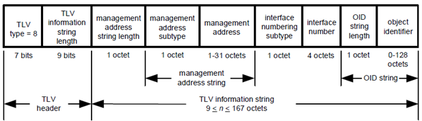

The "Management Address" TLV advertises an address that can be used to manage the device at higher layers, such as an IPv4 or IPv6 management IP. It may also include the interface index and an optional object identifier (OID). This TLV helps network management systems discover how to reach the device, but it does not imply reachability or configure routing.

Note that some TLVs are allowed to appear multiple times in a single LLDPDU, while others are restricted to a single instance. "Management Address" is the most common repeated TLV. A device can have multiple management addresses, and each address requires its own TLV instance. Examples:

- One TLV for IPv4 management address
- One TLV for IPv6 management address
- One TLV for out-of-band management interface

### TLV Types 9-126 - Reserved

TLV types 9 through 126 are reserved by IEEE for future use. Devices must not transmit TLVs in this range unless explicitly defined by a future standard. Receivers encountering unknown TLVs in this range must ignore them. This reservation ensures long-term extensibility without breaking backward compatibility.

### TLV Type 127 - Organizationally Specific TLVs

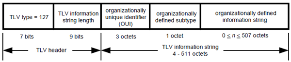

The "Organizationally Specific" TLV allows standards bodies and vendors to extend LLDP beyond the base specification. These TLVs are identified by an Organizationally Unique Identifier (OUI) and a subtype. Two widely used standard OUIs are:

- **IEEE 802.1** (OUI: 00:80:C2) - bridging, VLANs, and protocol visibility
- **IEEE 802.3** (OUI: 00:12:0F) - Ethernet MAC/PHY and link properties

These TLVs enable LLDP to support advanced use cases while remaining interoperable. Also note that these TLVs remain informational. They do not configure the device, do not affect forwarding, and do not participate in routing decisions.

## IEEE 802.1 Organizationally Specific TLVs (OUI 00:80:C2)

IEEE 802.1 TLVs focus on Layer-2 bridging behavior, especially VLAN-related information and protocol awareness.

| Subtype | TLV Name                  | Purpose                            |
| ------: | ------------------------- | ---------------------------------- |
|       0 | Reserved                  | Not used                           |
|       1 | Port VLAN ID              | Advertises the port’s default VLAN |
|       2 | Port and Protocol VLAN ID | Advertises VLAN per protocol       |
|       3 | VLAN Name                 | Advertises VLAN names              |
|       4 | Protocol Identity         | Advertises supported protocols     |
|   5-255 | Reserved                  | Future use                         |

### Port VLAN ID TLV (Subtype 1)

The "Port VLAN ID" (PVID) TLV advertises the default VLAN assigned to the port. This VLAN is used for untagged or priority-tagged Ethernet frames received on the interface. This TLV is particularly useful for:

- Discovering access-port VLAN assignments
- Detecting VLAN mismatches between connected devices
- Zero-touch provisioning and topology tools

It is informational only; it does not cause the neighbor to change VLAN configuration.

### Port and Protocol VLAN ID TLV (Subtype 2)

The "Port and Protocol VLAN ID" TLV extends VLAN advertisement by associating specific Layer-2 protocols with specific VLANs on a port. This allows a device to express: "Traffic for protocol X should be associated with VLAN Y on this port". This TLV is rarely used in modern networks but exists to support protocol-based VLAN classification scenarios.

### VLAN Name TLV (Subtype 3)

The "VLAN Name" TLV advertises the human-readable name assigned to a VLAN on the device. This is useful for:

- Operational visibility
- Topology documentation
- Troubleshooting mismatched VLAN naming conventions

The VLAN name does not imply VLAN existence or configuration on the receiving device.

### Protocol Identity TLV (Subtype 4)

The "Protocol Identity" TLV advertises which Layer-2 or higher-layer protocols are accessible through the port (for example, certain control or encapsulated protocols). This TLV helps management systems understand what types of traffic or protocols are expected on a given link. It does not enable or disable those protocols.

## IEEE 802.3 Organizationally Specific TLVs (OUI 00:12:0F)

IEEE 802.3 TLVs describe Ethernet physical-layer and link-layer characteristics, including speed, duplex, power, and aggregation.

| Subtype | TLV Name                     | Purpose                        |
| ------: | ---------------------------- | ------------------------------ |
|       0 | Reserved                     | Not used                       |
|       1 | MAC/PHY Configuration/Status | Speed, duplex, autonegotiation |
|       2 | Power via MDI                | Power over Ethernet (PoE)      |
|       3 | Link Aggregation             | LAG capability and membership  |
|       4 | Maximum Frame Size           | Supported MTU                  |
|   5-255 | Reserved                     | Future use                     |

### MAC/PHY Configuration/Status TLV (Subtype 1)

This TLV advertises Ethernet physical-layer properties of the transmitting port, including:

- Supported speeds and duplex modes
- Current operational speed and duplex
- Whether auto-negotiation was used or overridden manually

This information allows a neighbor or management system to:

- Detect speed or duplex mismatches
- Verify auto-negotiation behavior
- Troubleshoot physical-layer issues

### Power via MDI TLV (Subtype 2)

The "Power via MDI" TLV advertises Power over Ethernet (PoE) capabilities and status. It communicates:

- Whether the device can source or consume power
- Supported power classes
- Current power allocation state

This TLV helps detect power mismatches between:

- PSE (Power Sourcing Equipment) - e.g., switches
- PD (Powered Devices) - e.g., phones, access points

A mismatch (for example, insufficient advertised power) can explain device instability or link failures.

### Link Aggregation TLV (Subtype 3)

The "Link Aggregation" TLV advertises whether:

- The port is capable of participating in a link aggregation group (LAG)
- The port is currently part of an aggregation
- The identifier of the aggregation (if applicable)

This TLV improves visibility into:

- LACP and static aggregation setups
- Multi-link connectivity between devices

It does not negotiate aggregation; it only reports status.

### Maximum Frame Size TLV (Subtype 4)

The "Maximum Frame Size" TLV advertises the largest Ethernet frame size (MTU) supported by the MAC and PHY. This TLV is valuable for:

- Detecting MTU mismatches
- Preventing silent packet drops
- Validating jumbo-frame configurations

Differences in supported frame size between neighbors can lead to hard-to-diagnose connectivity issues, making this TLV operationally important.
