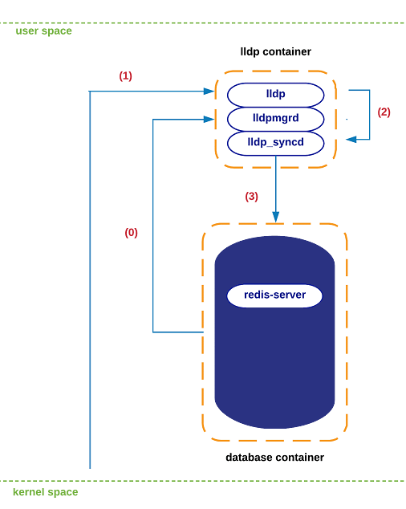
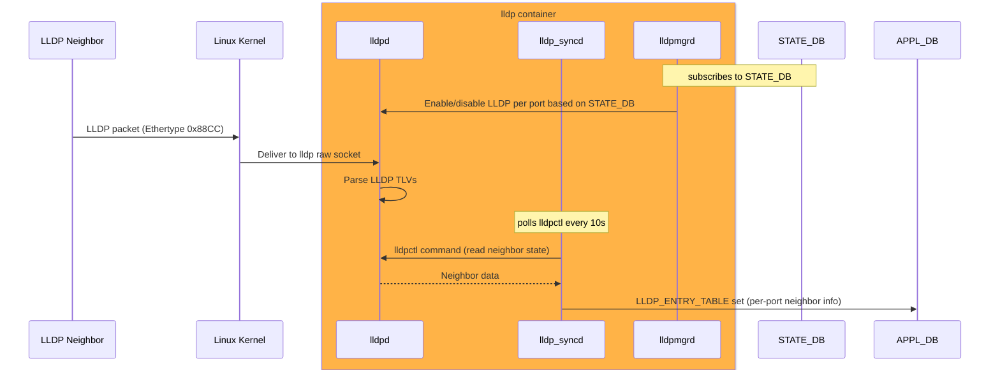

# LLDP Architecture in SONiC

SONiC implements LLDP as a dedicated Docker-based service. LLDP runs inside a container named `lldp`. This container is responsible for all LLDP protocol operations on the device, including the transmission and reception of LLDP frames, TLV processing, and the publication of neighbor information to SONiC's internal database.

LLDP operates entirely at Layer 2 (Ethernet). It is carried directly in Ethernet frames and does not use IP, TCP, or UDP. Because of this, you do not need IPv4 or IPv6 addresses. Moreover, you do not need VLAN or forwarding configuration.

## LLDP Daemons

Within the LLDP container, three primary daemons operate together to provide full LLDP functionality:

- `lldpd`
- `lldp_syncd`
- `lldpmgrd`

### lldpd (The Protocol Engine)

This is the core Link Layer Discovery Protocol daemon. SONiC uses the standard, widely adopted open-source lldpd (often the implementation by Vincent Bernat) rather than reinventing the wheel. It handles the actual mechanics of the LLDP protocol on the wire. It crafts and transmits LLDP frames out of the physical switch ports, receives incoming LLDP frames from neighboring devices, and maintains the internal LLDP state machine. It knows everything about who is connected to the switch, but natively, it does not know how to communicate with SONiC's central Redis database.

### lldp_syncd (The State Synchronizer)

Because lldpd is a standard Linux daemon isolated from Redis, lldp_syncd acts as its northbound translator. It exports state out of the protocol engine. It runs on a scheduled timer, executing the `lldpctl` command every 10 seconds to scrape the network neighbor information that lldpd has discovered. Once it grabs this data, it formats and publishes it into the SONiC Application Database (`APPL_DB`). This ensures components like the CLI, SNMP agents, and telemetry services can read neighbor data without querying the lldpd directly.

### lldpmgrd (The Configuration Manager)

If lldp_syncd exports state, lldpmgrd is responsible for pushing port status into the protocol engine. It translates database state changes into commands lldpd understands. It subscribes to the State Database (`STATE_DB`) to monitor physical port up/down events. It relies on a 5-second polling cycle as a fallback reconciliation loop to ensure lldpd is always in sync with actual physical port states.

## LLDP State Flow

### Container Initialization and Port State Tracking

Before any LLDP packets are exchanged, the system needs to know which ports are active. During the lldp container initialization, lldpmgrd subscribes to the STATE_DB (specifically the port table) to get a live feed of the physical port states across the switch. Based on port up/down events, lldpmgrd dynamically instructs lldpd to enable or disable LLDP processing on those specific interfaces.

### Packet Arrival at the Kernel

When a neighboring switch transmits an LLDP packet, it arrives at the local switch's physical port. The LLDP frame is handled by the Linux kernel's network stack. The kernel routes this payload to the raw socket listened to by the lldpd process running inside the Docker container.

### Protocol Parsing and State Extraction

Once lldpd receives the raw packet, it acts as the protocol engine. It decodes the LLDP Type-Length-Values (TLVs), which contain neighbor information such as the Chassis ID, Port ID, System Name, and System Capabilities. The standard lldpd process does not push data out on its own. Instead, lldp_syncd runs on a timer (typically every 10 seconds) and executes the `lldpctl` command to read the internal neighbor state from lldpd.

### Updating the Central Database

With the neighbor data now pulled from lldpd, the synchronizer bridges the gap to SONiC's central architecture. lldp_syncd pushes the formatted per-port neighbor information into the APPL_DB inside Redis. The data is specifically written to the LLDP_ENTRY_TABLE.

### Notification to Subscribed Entities

Once the state is written to APPL_DB, any service subscribed to those Redis tables is immediately notified of the change. In the SONiC ecosystem, the SNMP service is the primary consumer of this data.
